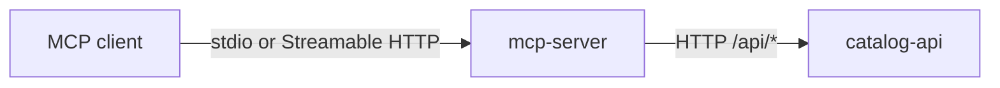

# GrooveMap MCP server

`mcp-server` presents the GrooveMap music catalog as fifteen
[Model Context Protocol (MCP)](https://modelcontextprotocol.io/) tools. It translates MCP
tool calls into HTTP requests to the separately deployed
[`catalog-api`](https://github.com/groovemap-music/catalog-api); it never connects directly
to a database.



This repository is licensed under the [MIT License](LICENSE).

## Tools

| Tool | Purpose |
| --- | --- |
| `search` | Search artists, labels, masters, and releases |
| `get_artist_details` | Read an artist and its catalog relationships |
| `get_label_details` | Read a label and its release count |
| `get_release_details` | Read release metadata |
| `get_genre_details` | Read genre metadata |
| `get_style_details` | Read style metadata |
| `find_path` | Find a shortest path between graph entities |
| `get_trends` | Read an entity's release timeline |
| `get_graph_stats` | Read graph-wide entity counts |
| `get_collaborators` | Read an artist collaboration network |
| `get_genre_tree` | Read the genre/style hierarchy |
| `nlq_query` | Ask a natural-language graph question |

The last three act for the collector rather than reading the catalog, so they require a
delegated app token and decline without one:

| Delegated tool | Purpose |
| --- | --- |
| `record_recommendation_outcome` | Report what the collector did with a recommendation |
| `get_consent` | Read the collector's current consent decisions |
| `set_consent` | Grant or revoke consent for one purpose |

Erasure and export are not tools. They are session-only rights the collector exercises for
themselves; see [transports and security](docs/security.md).

The [tool reference](docs/tools.md) documents inputs, Catalog API routes, and validation.

## Run locally

Install the pinned tools and environment, then point the server at a local Catalog API:

```bash
mise install
just setup
API_BASE_URL=http://localhost:8004 uv run groovemap-mcp
```

The default transport is `stdio`, which is appropriate when an MCP client launches the
server as a subprocess. Streamable HTTP can be selected explicitly for a local integration
test:

```bash
API_BASE_URL=http://localhost:8004 uv run groovemap-mcp --transport streamable-http
```

With no transport kwargs exposed by this adapter, the pinned MCP SDK binds Streamable HTTP
to `127.0.0.1:8000` at `/mcp`. This repository does not provide a public bind-address or
ingress configuration; see [transport and security boundaries](docs/security.md) before
designing a hosted deployment.

Example local client configuration:

```json
{
  "mcpServers": {
    "groovemap": {
      "command": "uv",
      "args": [
        "--project",
        "/absolute/path/to/mcp-server",
        "run",
        "groovemap-mcp"
      ],
      "env": {
        "API_BASE_URL": "http://localhost:8004"
      }
    }
  }
}
```

Replace `/absolute/path/to/mcp-server` with a stable absolute path to this checkout. The
client can then launch the project entry point without depending on shell activation or a
global package installation.

Do not commit generated client configuration when it contains credentials or
machine-specific paths. See [configuration](docs/configuration.md) and
[transport and security boundaries](docs/security.md) before exposing the server beyond a
local process boundary.

The authentication boundary is mostly outside this adapter. The catalog tools send no
Catalog API credential and this repository configures no hosted ingress protection, so keep
both hops within a trusted boundary unless `deployment` supplies those controls. The three
delegated tools are the exception: they present the app token in
`GROOVEMAP_CATALOG_APP_TOKEN` and decline when it is unset.

## Observability

The server pushes OpenTelemetry metrics and traces over OTLP/HTTP when
`OTEL_EXPORTER_OTLP_ENDPOINT` is set; with it unset, telemetry is a no-op and the server
behaves exactly as it does today. Neither signal can fail startup or a tool call, and the exit
path force-flushes both providers so even a short stdio session exports what it recorded.

Every tool call increments `groovemap.mcp.tool.calls` with `{tool, outcome}` and records
`groovemap.mcp.tool.duration` with `{tool}`. The adapter handler runs inside an
`mcp.tool {tool}` span with `{tool, outcome}`; on a real MCP request that span is a child of
the SDK's `tools/call {tool}` server span. Catalog API requests are instrumented via
`instrument_httpx`, so each request is a child of the adapter span and carries
`traceparent` into `catalog-api`.

The process view (`process.cpu.time`, `process.memory.usage`, `process.thread.count`,
`process.open_file_descriptor.count`, `process.context_switches`, and the CPython
garbage-collection counter) arrives with `setup_telemetry`. The server does run an asyncio
loop — `mcp.run()` creates it for both transports — so the lifespan also starts
`start_event_loop_monitor()`, which samples `groovemap.runtime.event_loop.lag`.

See [configuration](docs/configuration.md#opentelemetry-metrics-and-traces) for the
environment variables and the full span and metric list.

## Develop

```bash
mise install
just setup
just check
```

The stable repository interface is:

- `just setup` — install the locked environment.
- `just check` — run the complete local pre-merge gate.
- `just test` — run the MCP adapter suite with coverage.
- `just coverage` — run the same coverage recipe used by CI.
- `just protocol-check` — verify the exported MCP tool surface and Catalog API
  compatibility.
- `just docs-check` — validate public documentation links, required content, and diagram
  fences.
- `just automation-check` — validate workflows and their recipe contract.
- `just secret-scan` — scan Git history and the working tree with Gitleaks.
- `just build` — build the wheel and source distribution.
- `just image` — build and inspect the local `mcp-server:local` Streamable HTTP image.
- `just release-dry-run` — generate checksums, SBOM, notices, and provenance without
  publishing.

Pull requests, including Dependabot pull requests, run the same required CI graph. Weekly
scheduled validation exercises that graph against newly disclosed dependency issues. Version
tags are the only release trigger; they retain attested package artifacts and publish the
repository-named `ghcr.io/groovemap-music/mcp-server` image.

The framework-neutral `groovemap-agent-tools` dependency is owned by
[`python-libraries`](https://github.com/groovemap-music/python-libraries/tree/main/agent-tools).
The [development guide](docs/development.md) explains the repository boundary and contract
promotion workflow.

## Documentation

- [Documentation index](docs/README.md)
- [Architecture and ownership](docs/architecture.md)
- [Tool reference](docs/tools.md)
- [Configuration](docs/configuration.md)
- [Transports and security](docs/security.md)
- [Development](docs/development.md)
- [Release compliance](docs/release-compliance.md)
- [Historical publication record](docs/history-rewrite-gate.md)
- [GrooveMap logging emoji convention](https://github.com/groovemap-music/.github/blob/main/docs/emoji-guide.md)

Hosted topology, credentials, network policy, and image rollout belong to the
[`deployment`](https://github.com/groovemap-music/deployment) repository.
