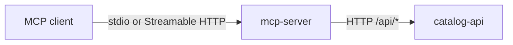

# GrooveMap MCP server

`mcp-server` presents the GrooveMap music catalog as twelve
[Model Context Protocol (MCP)](https://modelcontextprotocol.io/) tools. It translates MCP
tool calls into HTTP requests to the separately deployed
[`catalog-api`](https://github.com/groovemap-music/catalog-api); it never connects directly
to a database.



This repository is licensed under the [MIT License](LICENSE).

## Tools

| Tool | Purpose |
| --- | --- |
| `search` | Search artists, labels, masters, and releases |
| `get_artist_details` | Read an artist and its catalog relationships |
| `get_label_details` | Read a label and its release count |
| `get_release_details` | Read release metadata |
| `get_genre_details` | Read genre metadata |
| `get_style_details` | Read style metadata |
| `find_path` | Find a shortest path between graph entities |
| `get_trends` | Read an entity's release timeline |
| `get_graph_stats` | Read graph-wide entity counts |
| `get_collaborators` | Read an artist collaboration network |
| `get_genre_tree` | Read the genre/style hierarchy |
| `nlq_query` | Ask a natural-language graph question |

The [tool reference](docs/tools.md) documents inputs, Catalog API routes, and validation.

## Run locally

Install the pinned tools and environment, then point the server at a local Catalog API:

```bash
mise install
just setup
API_BASE_URL=http://localhost:8004 uv run groovemap-mcp
```

The default transport is `stdio`, which is appropriate when an MCP client launches the
server as a subprocess. An explicitly designed hosted deployment can select Streamable
HTTP:

```bash
API_BASE_URL=http://localhost:8004 uv run groovemap-mcp --transport streamable-http
```

Example local client configuration:

```json
{
  "mcpServers": {
    "groovemap": {
      "command": "uv",
      "args": [
        "--project",
        "/absolute/path/to/mcp-server",
        "run",
        "groovemap-mcp"
      ],
      "env": {
        "API_BASE_URL": "http://localhost:8004"
      }
    }
  }
}
```

Replace `/absolute/path/to/mcp-server` with a stable absolute path to this checkout. The
client can then launch the project entry point without depending on shell activation or a
global package installation.

Do not commit generated client configuration when it contains credentials or
machine-specific paths. See [configuration](docs/configuration.md) and
[transport and security boundaries](docs/security.md) before exposing the server beyond a
local process boundary.

The authentication boundary is outside this adapter: the current server sends no Catalog
API credential and configures no hosted ingress protection. Keep both hops within a trusted
boundary unless `deployment` supplies those controls.

## Develop

```bash
mise install
just setup
just check
```

The stable repository interface is:

- `just setup` — install the locked environment.
- `just check` — run formatting, typing, tests, protocol/contract checks, builds, license
  checks, and a Commitizen preview.
- `just test` — run the MCP adapter suite with coverage.
- `just protocol-check` — verify the exported MCP tool surface and Catalog API
  compatibility.
- `just build` — build the wheel and source distribution.
- `just image` — build and inspect the local `mcp-server:local` Streamable HTTP image.
- `just release-dry-run` — generate checksums, SBOM, notices, and provenance without
  publishing.

Pull requests, including Dependabot pull requests, run the same required CI graph. Weekly
scheduled validation exercises that graph against newly disclosed dependency issues. Version
tags are the only release trigger; they retain attested package artifacts and publish the
repository-named `ghcr.io/groovemap-music/mcp-server` image.

The framework-neutral `groovemap-agent-tools` dependency is owned by
[`python-libraries`](https://github.com/groovemap-music/python-libraries/tree/main/agent-tools).
The [development guide](docs/development.md) explains the repository boundary and contract
promotion workflow.

## Documentation

- [Documentation index](docs/README.md)
- [Architecture and ownership](docs/architecture.md)
- [Tool reference](docs/tools.md)
- [Configuration](docs/configuration.md)
- [Transports and security](docs/security.md)
- [Development](docs/development.md)
- [Release compliance](docs/release-compliance.md)
- [History rewrite approval gate](docs/history-rewrite-gate.md)
- [GrooveMap logging emoji convention](https://github.com/groovemap-music/.github/blob/main/docs/emoji-guide.md)

Hosted topology, credentials, network policy, and image rollout belong to the
[`deployment`](https://github.com/groovemap-music/deployment) repository.
