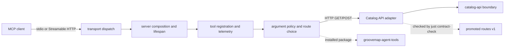

# MCP server architecture

The `mcp-server` repository adapts GrooveMap's HTTP catalog interface to Model Context
Protocol tools. It deliberately has no direct Neo4j, PostgreSQL, RabbitMQ, or Redis
access.

## Request path

1. An MCP client invokes one of the server's fifteen tools.
2. The MCP SDK validates the generated input schema, then `tool_routing` applies the
   adapter's value policy and selects a promoted Catalog API v1 route.
3. The catalog routes are public, no-token Catalog API routes; the three delegated tools
   carry a scoped app token supplied by configuration; erasure and export are never
   exposed as tools. `catalog-api` applies route validation, rate limiting, query
   semantics, and persistence policy.
4. The server returns the Catalog API JSON result as the MCP tool result. Transport and
   upstream failures are returned as structured error objects.

The promoted contract under [`contracts/catalog-api/mcp-server/v1`](../contracts/catalog-api/mcp-server/v1)
is the compatibility boundary. [`routes.json`](../contracts/catalog-api/mcp-server/v1/routes.json)
is version 1 and records every operation `catalog-api` publishes for this consumer,
including the erasure and export routes no tool exposes; eleven of them back the fifteen
tools.
[`source.json`](../contracts/catalog-api/mcp-server/v1/source.json) pins the `catalog-api`
producer repository and commit plus the routes digest. `just contract-check` verifies the
digest, version, and every literal adapter route; `just protocol-check` also verifies the
exported MCP names and input schemas.

## Ownership

- `mcp_server.server` is the composition root. It brackets the telemetry lifecycle,
  constructs the instrumented HTTP client, creates `MCPServer`, and
  re-exports the established public entry points.
- `mcp_server.transport` parses the supported CLI flags and dispatches the selected MCP
  SDK transport, preserving `stdio` as the fallback.
- `mcp_server.registration` binds the stable ordered handler set to MCP and applies
  tool-level instrumentation.
- `mcp_server.tool_routing` owns tool descriptions, argument validation, and route choice.
- `mcp_server.catalog_api` owns Catalog API request/response adaptation, HTTP error
  mapping, and the one place that decides whether a request carries the delegated app
  token. The token reaches it from the lifespan state and never from a tool argument.
- `mcp_server.telemetry` owns adapter tool metrics and handler spans. Runtime telemetry setup, HTTP
  instrumentation, and shutdown remain at the composition root.
- [`python-libraries`](https://github.com/groovemap-music/python-libraries/tree/main/agent-tools)
  owns framework-neutral `groovemap-agent-tools` behavior shared with other consumers.
- [`catalog-api`](https://github.com/groovemap-music/catalog-api) owns HTTP route policy,
  including authentication and authorization where a route implements them. It decides what
  the delegated app token is allowed to do; this adapter only presents it.
- [`deployment`](https://github.com/groovemap-music/deployment) owns hosted topology,
  ingress authentication, credentials, network policy, and image rollout.

`catalog-api` internals and database implementation deliberately stop at the boundary node
in the diagram. This repository consumes published HTTP routes and installed packages; it
does not import another repository's source tree or require a sibling checkout at runtime.

See the [tool reference](tools.md), [transport and security boundaries](security.md), and
[documentation index](README.md).
