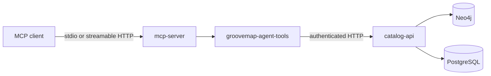

# MCP server architecture

The `mcp-server` repository adapts GrooveMap's HTTP API to Model Context Protocol tools.
It deliberately has no direct Neo4j, PostgreSQL, RabbitMQ, or Redis access.

## Ownership

- `mcp-server` owns MCP transport, tool registration, argument conversion, and
  protocol-level errors.
- `python-libraries` owns the framework-neutral `groovemap-agent-tools` client.
- `catalog-api` owns authentication, authorization, rate limits, query semantics, and
  persistence access.
- `deployment` owns hosted topology, credentials, and network policy.

The promoted contract under `contracts/catalog-api/mcp-server/v1` is the compatibility
boundary. `just protocol-check` verifies the exported tools and API paths.

See the [documentation index](README.md) and the canonical
[logging emoji convention](https://github.com/groovemap-music/.github/blob/main/docs/emoji-guide.md).
