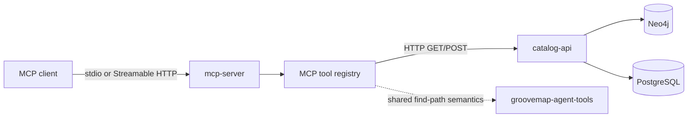

# MCP server architecture

The `mcp-server` repository adapts GrooveMap's HTTP catalog interface to Model Context
Protocol tools. It deliberately has no direct Neo4j, PostgreSQL, RabbitMQ, or Redis
access.

## Request path

1. An MCP client invokes one of the server's twelve tools.
2. The server validates MCP arguments and converts the call to a promoted Catalog API v1
   route.
3. The promoted v1 routes used by this adapter are public, no-token Catalog API routes.
   `catalog-api` applies route validation, rate limiting, query semantics, and persistence
   policy.
4. The server returns the Catalog API JSON result as the MCP tool result. Transport and
   upstream failures are returned as structured error objects.

The promoted contract under [`contracts/catalog-api/mcp-server/v1`](../contracts/catalog-api/mcp-server/v1)
is the compatibility boundary. `just protocol-check` verifies the exported MCP surface,
route set, and producer provenance.

## Ownership

- `mcp-server` owns MCP transport selection, tool registration, argument validation,
  Catalog API request adaptation, and protocol-level errors.
- [`python-libraries`](https://github.com/groovemap-music/python-libraries/tree/main/agent-tools)
  owns framework-neutral `groovemap-agent-tools` behavior shared with other consumers.
- [`catalog-api`](https://github.com/groovemap-music/catalog-api) owns HTTP route policy,
  including authentication and authorization where a route implements them. The promoted
  MCP v1 routes do not currently implement token authentication.
- [`deployment`](https://github.com/groovemap-music/deployment) owns hosted topology,
  ingress authentication, credentials, network policy, and image rollout.

See the [tool reference](tools.md), [transport and security boundaries](security.md), and
[documentation index](README.md).
