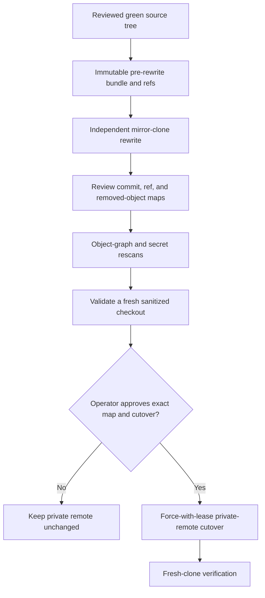

# History rewrite approval gate

This procedure prepares evidence; it does not authorize a rewrite. It operates in independent
backup and sanitized clones. The working repository and its remotes are never rewritten in place.

## Scope

The rehearsal removes raw private planning paths from every reachable commit:

- `.planning/`
- `docs/superpowers/plans/`
- `docs/superpowers/specs/`
- `docs/extraction.md`

The private `planning-archive` repository at commit
`4d0ecef0a798aab2f769cb5eb2e93982236f4f91` preserves the source records. The evidence maps every
removed path object to that immutable archive prerequisite.



Run the checked-in rehearsal with absolute paths:

```bash
export PLANNING_ARCHIVE_REPO=/absolute/path/to/planning-archive
export GROOVEMAP_LIBRARIES_REPO=/absolute/path/to/python-libraries
just history-rehearsal /absolute/path/to/mcp-server /absolute/new/evidence-directory
```

The output directory must not already exist. The command creates an independently verified Git
bundle, backup and sanitized mirrors, before-and-after ref inventories, commit and ref maps, a
removed-object-to-archive map, full object-graph and secret-scan evidence, and a fresh sanitized
checkout validation log. Evidence permissions are restricted to the current user.

## Separate cutover approval

No push follows automatically. The operator must explicitly approve the reviewed map, exact
private remote, expected force-with-lease values, maintenance window, rollback owner, and backup
retention. Any remote drift invalidates the evidence and requires a new rehearsal. Repository
visibility remains unchanged, and no tag, release, package, or image is created or deleted.
