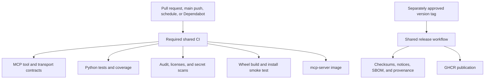

# Release compliance

No repository validation command publishes a package, image, tag, release, deployment, or
repository setting. Publication requires an approved annotated version tag and the separately
controlled hosted release workflow.

## Local gates

- `just check` verifies formatting, linting, documentation, promoted contracts, types, the MCP
  protocol surface, tests and coverage, package construction, installed-wheel behavior,
  dependency licenses, secret scans, and version consistency.
- `just audit` checks the locked Python environment for known vulnerabilities.
- `just image` builds and inspects the repository-named non-root image with its exact source
  revision and MIT license metadata.
- `just release-dry-run` creates the wheel, source archive, checksums, notices, SBOM, and
  provenance locally without publishing anything.

## Automation

The thin CI and release callers pin `groovemap-music/automation` by a reviewed forty-character
commit. CI runs for pushes to `main`, ordinary and Dependabot-authored pull requests, manual
dispatches, and weekly scheduled validation. Every pull request uses one required job graph;
there is no actor-specific skip or reduced dependency-update path.

Complete validation fetches the public `python-libraries` repository at the immutable revision
recorded in `pyproject.toml`. Neither workflow accepts a first-party repository credential or
inherits secrets. CI maps only `CODECOV_TOKEN` explicitly, and uploads fail closed. Repository
policy rejects the retired GitHub App credential markers and mutable workflow references.

## Historical publication note

Before this repository became public, raw migration plans were preserved in private
`planning-archive` and removed from both the published tree and its reachable object graph. The
retained [historical publication record](history-rewrite-gate.md) describes that completed
boundary. No validation or release recipe rewrites history or changes repository visibility.
