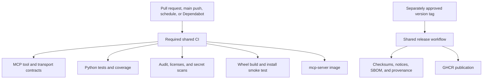

# Release compliance

No repository validation command publishes a package, image, tag, release, deployment, or
repository setting. Publication requires an approved annotated version tag and the separately
controlled hosted release workflow.

## Local gates

- `just check` verifies formatting, linting, documentation, promoted contracts, types, the MCP
  protocol surface, tests and coverage, package construction, installed-wheel behavior,
  dependency licenses, secret scans, and version consistency.
- `just audit` checks the locked Python environment for known vulnerabilities.
- `just image` builds and inspects the repository-named non-root image with its exact source
  revision and MIT license metadata.
- `just release-dry-run` creates the wheel, source archive, checksums, notices, SBOM, and
  provenance locally without publishing anything.

## Automation

The thin CI and release callers pin `groovemap-music/automation` by a reviewed forty-character
commit. CI runs for pushes to `main`, ordinary and Dependabot-authored pull requests, manual
dispatches, and weekly scheduled validation. Every pull request uses one required job graph;
there is no actor-specific skip or reduced dependency-update path.

Complete validation requires read access to the pinned `python-libraries` revision.
`GROOVEMAP_CI_APP_CLIENT_ID` and `GROOVEMAP_CI_APP_PRIVATE_KEY` supply that read-only checkout.
`CODECOV_TOKEN` is mapped explicitly and uploads fail closed. Infrastructure provides the same
credential names to ordinary Actions and Dependabot.

## Historical planning privacy

Raw migration plans are preserved in private `planning-archive` and removed from both the current
public tree and every reachable historical object. The filtered clone is the only permissible
rewrite target. Replacing the private remote from that clone and making the repository public are
separate operator-approved actions; neither is performed by repository validation.
